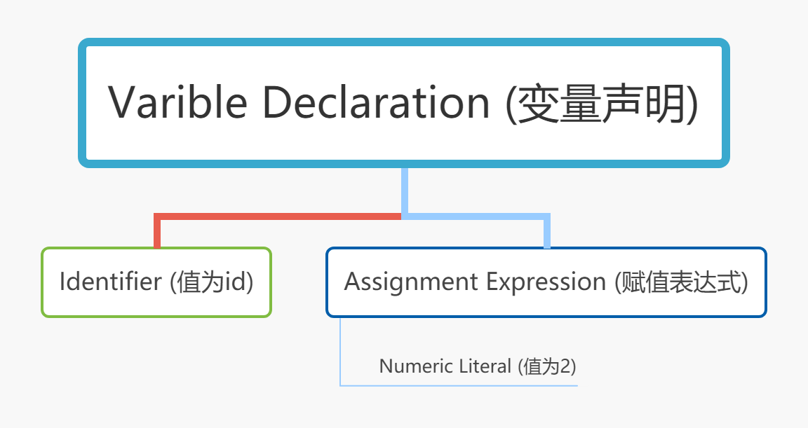

# 作用域与闭包(Scope & Closures)

## 作用域
在开始讲作用域之前，我们需要先明白，JS和普通解释型语言(例如python)不同，JS并不是直接从上而下逐行执行代码。运行js代码包含以下两个阶段：
- 解析/编译(包括词法分析、语法分析等)
- 执行
  
我们通过以下几个小例子验证：

- 语法错误
```javascript
var greeting = "Hello";
console.log(greeting);
greeting = ."Hi";// SyntaxError: unexpected token .
```
该程序不产生任何输出（不打印“ Hello”），而是抛出SyntaxError。
由于语法错误发生在格式正确的console.log（..）语句之后，因此，如果JS是直接逐行执行自上而下的操作，则可以期望在引发语法错误之前打印`hello`消息。


- 命名冲突
```javascript
console.log("Howdy");
saySomething("Hello","Hi");
// Uncaught SyntaxError: Duplicate parameter name not
// allowed in this context
function saySomething(greeting,greeting) {
    "use strict";
    console.log(greeting);
}
```
尽管代码格式正确，但不会打印`Howdy`消息。
和上个例子一样，这里的SyntaxError在执行程序之前引发。在这种情况下，这是因为严格模式下禁止函数具有重复的参数名称。

那JS引擎如何知道greeting参数已重复？唯一合理的解释是，在执行任何代码之前必须首先对代码进行完全解析。

- 引用错误
```javascript
function saySomething() {
    var greeting = "Hello";
    {
        greeting = "Howdy";  // ReferenceError: Cannot access 'greeting' before initialization
        let greeting = "Hi";
        console.log(greeting);
    }
}
saySomething(); 
```
注意当程序运行到`greeting = "Howdy";`时候会抛出`ReferenceError: Cannot access 'greeting' before initialization`异常，发生该异常的原因是是该语句的greeting变量属于下一行的声明`let greeting = "Hi"`，而不是先前的`var greeting = "Hello"`语句。

很明显JS引擎可以在抛出错误的那一行知道该行的下一条语句将声明一个具有相同名称的块作用域变量（`greeting`）的唯一方法是JS引擎已在较早的过程中处理了此代码，并且已经设置了所有作用域及其变量关联。而作用域和声明的这种处理只能通过在执行之前解析程序来准确地完成。


在了解完JS程序的两阶段处理后，现在我们将注意力转向JS引擎如何识别变量并确定其作用域。

### 什么是作用域

作用域是使用一套严格的规则来分辨哪些标识符对那些语法有访问权限.

我们先看一段简单的JS代码
```javascript
var students = [
    { id: 14, name: "Kyle" },
    { id: 73, name: "Suzy" },
    { id: 112, name: "Frank" },
    { id: 6, name: "Sarah" }
];
function getStudentName(studentID) {
    for (let student of students) {
        if (student.id == studentID) {
            return student.name;
        }
    }
}
var id = 73;
var nextStudent = getStudentName(id);
console.log(nextStudent);
```
在编译阶段，JS引擎先将代码分解成词法单元，然后将词法单元解析成一个树结构。以`var id = 73;`这行代码为例，编译器首先将该代码分解成以下词法单元：`var`、`id`、`=`、`73`、`;`。然后将词法单元流（数组）转换成一个由元素逐级嵌套所组成的代表了程序语法结构的树。这个树被称为“抽象语法树”（Abstract Syntax Tree, AST），如下图：

当语法树生成完毕后，JS引擎开始把语法树编译成一组机器指令准备执行，对于`var id = 73;`来说，编译器会创建一个叫`id`的变量(包括分配内存等)，并将值73储存在`id`中。这个过程实际会经如下处理：
1. 遇到`var id`，编译器会询问作用域是否已经有一个该名称的变量存在于同一个作用域的集合中。如果是，编译器会忽略该声明，继续进行编译;否则它会要求在当前作用域的集合中声明一个新的变量，并命名为 `id`。
2. 接下来编译器会为引擎生成运行时所需的代码，这些代码被用来处理`id = 73`这个赋值操作。引擎运行时会首先询问作用域，在当前的作用域集合中是否存在一个叫作`id`的变量。如果是，引擎就会使用这个变量;如果否，引擎会继续查找该变量。如果引擎最终找到了`id`变量，就会将73赋值给它。否则引擎就会举手示意并抛出一个异常（ReferenceError）!

### LHS 和 RHS

上述例子中，查找变量`id`并赋值的过程叫`LHS引用`(目标引用)。另一个查找的类型叫`RHS引用`(源引用)，`RHS引用`是查找变量的执行的值。区分这两种引用的一个简单做法是看这个过程有没有分配值，有的话则为`LHS引用`；没有则为`RHS引用`。

以上述代码为例，`LHS引用`包含以下这六处：
1. `var students = ...;`
2. `var id = 73;`
3. `var nextStudent = getStudentName(id);`
4. `let student of students`该语句为循环的每次迭代分配一个值给student
5. 将变量id传递给函数getStudentName的参数studentID，此时需要对studentID进行LHS引用（隐含）
6. 函数getStudentName的定义，实际上可以看成类似于 `var getStudentName = function(studentID) {...}`，getStudentName和函数之间的关联是在作用域的开头自动设置的，而不是等待=赋值语句被执行。

`RHS引用`包含以下这五处：
1. `let student of students`
2. `student.id == studentID`，student和studentID均为源引用
3. `return student.name;`, student为源引用，name是变量属性，不是引用
4. `var nextStudent = getStudentName(id);`，getStudentName为指向函数的源引用，id为指向值73的源引用
5. `console.log(nextStudent);`，console和nextStudent均为源引用

### 变量/标识符查找流程
不管是LHS还是RHS，JS引擎都会先从当前代码所在块作用域查找，如果没找到，则到外层作用域查找。依次类推，直到全局作用域，无论有没有找到都会停止。

### 异常
区分LHS和RHS的一个重要原因是，如果直到全局作用域都没找到变量，那这两种引用的结束行为是不一样的。

当RHS找不到变量时，会抛出ReferenceError。如果找到了，但进行了不合理的操作，例如对一个整型值进行了函数调用，则会抛出TypeError。

```javascript
var a =b; //ReferenceError: b is not defined
```
```javascript
var i=0; 
i(); //TypeError: i is not a function
```


当LHS找不到变量时，如果是在非`use strict`模式下，则会自动在全局作用域创建该名称的变量。如果在`use strict`模式下，则会抛出ReferenceError。

```javascript
//非`use strict`模式
function foo(){
    a = 1;  
}
foo();
console.log(a);//1
```


```javascript
//`use strict`模式
function foo(){
    'use strict';
    a = 1;  
}
foo();
console.log(a);//ReferenceError: a is not defined
```
## 闭包

函数和对其周围状态（lexical environment，词法环境）的引用捆绑在一起构成闭包（closure）。也就是说，闭包可以让你从内部函数访问外部函数作用域。在 JavaScript 中，每当函数被创建，就会在函数生成时生成闭包。


我们把之前的例子扩展一下：
```javascript
function lookupStudent(studentID) {
    var students = [
        { id: 14, name: "Kyle" },
        { id: 73, name: "Suzy" },
        { id: 112, name: "Frank" },
        { id: 6, name: "Sarah" }
    ];

    return function greetStudent(greeting){
        var student = students.find(
            student => student.id == studentID
        );

        return `${ greeting }, ${ student.name }!`;
    };
}

var chosenStudents = [
    lookupStudent(6),
    lookupStudent(112)
];

// accessing the function's name:
console.log(chosenStudents[0].name);// greetStudent

console.log(chosenStudents[0]("Hello"));// Hello, Sarah!

console.log(chosenStudents[1]("Howdy"));// Howdy, Frank!
```
此代码的第一件事要注意的是`lookupStudent(..)`外部函数创建并返回一个称为`greetStudent(..)`的内部函数。
`lookupStudent(..)`被调用两次，产生其内部`greetStudent(..)`函数的两个单独实例，这两个实例均保存到`selectedStudents`数组中。

而每次对`lookupStudent(...)`的调用完成后，似乎所有其内部变量都将被丢弃并进行GC回收，内部函数`greetStudent`似乎是唯一要返回并保留的东西。但实际上，每个`greetStudent(...)`实例都能访问创建当时的外部函数作用域，包括当时的`studentID`和`students`。原因在于，闭包是由函数以及声明该函数的词法环境组合而成的，该环境包含了这个闭包创建时作用域内的所需的局部变量。

### 对变量闭包还是对作用域闭包
闭包要思考的一个问题是：我们应该认为闭包仅应用于引用的外部变量，还是闭包保留了整个作用域链及其所有变量。

理论上，闭包仅应用于引用的外部变量可能会更合理点。我们可以从以下例子观察：
```javascript
function manageStudentGrades(studentRecords) {
    var grades = studentRecords.map(getGrade);

    return addGrade;

    // ************************

    function getGrade(record){
        return record.grade;
    }

    function sortAndTrimGradesList() {
        // sort by grades, descending
        grades.sort(function desc(g1,g2){
            return g2 - g1;
        });

        // only keep the top 10 grades
        grades = grades.slice(0,10);
    }

    function addGrade(newGrade) {
        grades.push(newGrade);
        sortAndTrimGradesList();
        return grades;
    }
}

var addNextGrade = manageStudentGrades([
    { id: 14, name: "Kyle", grade: 86 },
    { id: 73, name: "Suzy", grade: 87 },
    { id: 112, name: "Frank", grade: 75 },
    // ..many more records..
    { id: 6, name: "Sarah", grade: 91 }
]);

// later

addNextGrade(81);
addNextGrade(68);
```
在代码`grades.push(newGrade);`加上断点，以调试方式运行，当命中断点时，可以观察到当前闭包作用域并不包含`studentRecords`和`getGrade`的引用。

### 闭包声明周期和GC

由于闭包本质上是与函数实例相关联的，因此只要仍存有对该函数的引用，闭包引用的变量就不会被释放。理解这个对构建高效的程序有重要的影响。因为闭包有可能意外地阻止GC回收已经无用的变量，从而导致内存逐渐消耗殆尽。


## 参考资料
- [你不知道的javascript](https://github.com/getify/You-Dont-Know-JS)
- [深入理解JS中声明提升、作用域（链）和this关键字](https://github.com/creeperyang/blog/issues/16)
- [javascript作用域和闭包之我见](https://www.cnblogs.com/xjchenhao/p/6516054.html)
- [深入理解javascript作用域系列第一篇——内部原理](https://www.cnblogs.com/xiaohuochai/p/5699739.html)
- [闭包](https://developer.mozilla.org/zh-CN/docs/Web/JavaScript/Closures)
